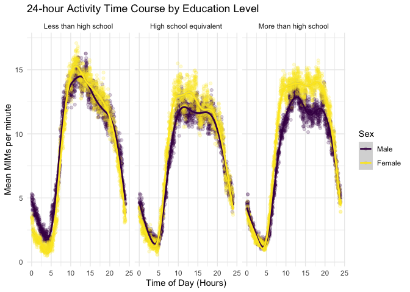

p8105_hw3_mnw2132
================
Mary Williams
10-16-2024

``` r
library(tidyverse)
library(ggplot2)
```

### Problem 1

``` r
library(p8105.datasets)
data("ny_noaa")
```

When looking at the data with:

``` r
summary(ny_noaa)
##       id                 date                 prcp               snow       
##  Length:2595176     Min.   :1981-01-01   Min.   :    0.00   Min.   :  -13   
##  Class :character   1st Qu.:1988-11-29   1st Qu.:    0.00   1st Qu.:    0   
##  Mode  :character   Median :1997-01-21   Median :    0.00   Median :    0   
##                     Mean   :1997-01-01   Mean   :   29.82   Mean   :    5   
##                     3rd Qu.:2005-09-01   3rd Qu.:   23.00   3rd Qu.:    0   
##                     Max.   :2010-12-31   Max.   :22860.00   Max.   :10160   
##                                          NA's   :145838     NA's   :381221  
##       snwd            tmax               tmin          
##  Min.   :   0.0   Length:2595176     Length:2595176    
##  1st Qu.:   0.0   Class :character   Class :character  
##  Median :   0.0   Mode  :character   Mode  :character  
##  Mean   :  37.3                                        
##  3rd Qu.:   0.0                                        
##  Max.   :9195.0                                        
##  NA's   :591786
sum(is.na(ny_noaa))
## [1] 3387623
```

there are 2,595,176 rows with 7 variables including id, date, prcp,
snow, snwd, tmax and tmin. id, tmax, and tmin are charecters, prcp, snow
and snwd are integers, and date is just date. Thre are 3387623 missing
variables. The rows that have all information besides id and date
missing, would be good to remove.

# Data cleaning

*Separate year, month, and date; clean names; make tmin and tmax
numeric, and change prcp, tmax and tmin, to no longer be “a tenth of…”*

``` r
cleaned_noaa = ny_noaa %>%
  janitor::clean_names() %>%
  separate("date", into = c("year", "month", "day"), sep = "3") %>%
   mutate(
    tmin = as.numeric(tmin),
    tmax = as.numeric(tmax),
    prcp = prcp / 10,
    tmax = tmax / 10,
    tmin = tmin / 10
  )
## Warning: Expected 3 pieces. Additional pieces discarded in 3195 rows [294782, 294792,
## 294802, 294809, 294810, 298253, 298263, 298273, 298280, 298281, 303640, 303650,
## 303660, 303667, 303668, 306955, 306965, 306975, 306982, 306983, ...].
## Warning: Expected 3 pieces. Missing pieces filled with `NA` in 2512229 rows [1, 2, 3, 4,
## 5, 6, 7, 8, 9, 10, 11, 12, 13, 14, 15, 16, 17, 18, 19, 20, ...].
```

# Checking cleaned data

``` r
summary(cleaned_noaa)
##       id                year              month               day           
##  Length:2595176     Length:2595176     Length:2595176     Length:2595176    
##  Class :character   Class :character   Class :character   Class :character  
##  Mode  :character   Mode  :character   Mode  :character   Mode  :character  
##                                                                             
##                                                                             
##                                                                             
##                                                                             
##       prcp              snow             snwd             tmax        
##  Min.   :   0.00   Min.   :  -13    Min.   :   0.0   Min.   :-38.9    
##  1st Qu.:   0.00   1st Qu.:    0    1st Qu.:   0.0   1st Qu.:  5.0    
##  Median :   0.00   Median :    0    Median :   0.0   Median : 15.0    
##  Mean   :   2.98   Mean   :    5    Mean   :  37.3   Mean   : 14.0    
##  3rd Qu.:   2.30   3rd Qu.:    0    3rd Qu.:   0.0   3rd Qu.: 23.3    
##  Max.   :2286.00   Max.   :10160    Max.   :9195.0   Max.   : 60.0    
##  NA's   :145838    NA's   :381221   NA's   :591786   NA's   :1134358  
##       tmin        
##  Min.   :-59.4    
##  1st Qu.: -3.9    
##  Median :  3.3    
##  Mean   :  3.0    
##  3rd Qu.: 11.1    
##  Max.   : 60.0    
##  NA's   :1134420
str(cleaned_noaa)
## tibble [2,595,176 × 9] (S3: tbl_df/tbl/data.frame)
##  $ id   : chr [1:2595176] "US1NYAB0001" "US1NYAB0001" "US1NYAB0001" "US1NYAB0001" ...
##  $ year : chr [1:2595176] "2007-11-01" "2007-11-02" "2007-11-0" "2007-11-04" ...
##  $ month: chr [1:2595176] NA NA "" NA ...
##  $ day  : chr [1:2595176] NA NA NA NA ...
##  $ prcp : num [1:2595176] NA NA NA NA NA NA NA NA NA NA ...
##  $ snow : int [1:2595176] NA NA NA NA NA NA NA NA NA NA ...
##  $ snwd : int [1:2595176] NA NA NA NA NA NA NA NA NA NA ...
##  $ tmax : num [1:2595176] NA NA NA NA NA NA NA NA NA NA ...
##  $ tmin : num [1:2595176] NA NA NA NA NA NA NA NA NA NA ...
cleaned_noaa
## # A tibble: 2,595,176 × 9
##    id          year       month day    prcp  snow  snwd  tmax  tmin
##    <chr>       <chr>      <chr> <chr> <dbl> <int> <int> <dbl> <dbl>
##  1 US1NYAB0001 2007-11-01 <NA>  <NA>     NA    NA    NA    NA    NA
##  2 US1NYAB0001 2007-11-02 <NA>  <NA>     NA    NA    NA    NA    NA
##  3 US1NYAB0001 2007-11-0  ""    <NA>     NA    NA    NA    NA    NA
##  4 US1NYAB0001 2007-11-04 <NA>  <NA>     NA    NA    NA    NA    NA
##  5 US1NYAB0001 2007-11-05 <NA>  <NA>     NA    NA    NA    NA    NA
##  6 US1NYAB0001 2007-11-06 <NA>  <NA>     NA    NA    NA    NA    NA
##  7 US1NYAB0001 2007-11-07 <NA>  <NA>     NA    NA    NA    NA    NA
##  8 US1NYAB0001 2007-11-08 <NA>  <NA>     NA    NA    NA    NA    NA
##  9 US1NYAB0001 2007-11-09 <NA>  <NA>     NA    NA    NA    NA    NA
## 10 US1NYAB0001 2007-11-10 <NA>  <NA>     NA    NA    NA    NA    NA
## # ℹ 2,595,166 more rows
```

# Most common observed snowfall values

``` r
cleaned_noaa %>%
group_by(snow) %>%
  summarize(count = n()) %>%
  arrange(desc(count))
## # A tibble: 282 × 2
##     snow   count
##    <int>   <int>
##  1     0 2008508
##  2    NA  381221
##  3    25   31022
##  4    13   23095
##  5    51   18274
##  6    76   10173
##  7     8    9962
##  8     5    9748
##  9    38    9197
## 10     3    8790
## # ℹ 272 more rows
```

The most common snowfall values were “0” with 2008508 and “NA” with
381221. This is likely because it does not snow often, especially in
some of the locations observed.

### Problem 2

# Load csv

``` r
MIMS_demographic <- read_csv("data/nhanes_covar.csv",
skip = 4, col_names = TRUE) %>%
drop_na()

MIMS_accel <- read_csv("data/nhanes_accel.csv")
merged_data <- merge(MIMS_demographic, MIMS_accel, by = "SEQN")
```

\#Merge and clean data

``` r
clean_data <- merged_data %>%
   janitor::clean_names() %>%
  filter(age >= 21) %>%
  mutate(
    sex = factor(sex, levels = c(1, 2), 
      labels = c("Male", "Female")),
    education = factor(education, levels = c(1, 2, 3), 
      labels = c("Less than high school", "High school equivalent", "More than high school")))
```

# 3x2 table

``` r
table <- clean_data %>%
   janitor::tabyl(education, sex) %>%

table
```

The above table shows the number of Male and Females there are in every
education level.

This table shows that there were \# Age Visualization

``` r
  ggplot(clean_data, aes(x = sex, y = age)) + 
    geom_boxplot() +
  facet_grid(.~education)  +    
  labs(title = "Age Distribution by Sex and Education Level",   
       x = "Sex",                                               
       y = "Age (Years)")
```

<!-- -->

The above boxplot shows the distribution of ages for sex and education
level, including medians, quartiles, min and max.

# Aggregate minutes for each participant

``` r
clean_data$total_MIMs <- rowSums(clean_data[, grepl("^min", names(clean_data))])
```

# ggplot for total activity

``` r
ggplot(clean_data, aes(x = age, y = total_MIMs, color = sex)) + 
    geom_point(alpha = .5) +
    geom_smooth(se = FALSE) +
    facet_grid(. ~ education) + 
    labs(title = "Total Activity vs Age by Sex and Education Level",
         x = "Age (Years)",
         y = "Total Activity (MIMs/1440 minutes)",
         color = "Sex") +
viridis::scale_color_viridis(discrete = TRUE) + 
  theme_minimal() + 
  theme(legend.position = "bottom")
```

<!-- -->
The plot above demonstrates the differences in total activity for men vs
women in 3 different education levels as their age increased. It can be
seen that while MIMs decrease with age for every education level, the
fluctuations in MIMs throughout the years is similar for men versus
women. However, the overall fluctuations are different for each
education level.

# 3 panel plot for 24 hr activity

``` r
data_with_means <- clean_data %>%
    group_by(education, sex) %>%
  summarize(across(min1:min1440, ~ mean(.x, na.rm = TRUE), .names = "mean_{col}"))

data_long <- data_with_means %>%
  pivot_longer(cols = starts_with("mean_min"), 
               names_to = "time", 
               values_to = "mean_activity") %>%
  mutate(time = as.numeric(gsub("mean_min", "", time)))

ggplot(data_long, aes(x = time/60, y = mean_activity, color = sex)) + 
  geom_point(alpha = .2) +
  facet_grid(. ~ education) +
  labs(
    title = "24-hour Activity Time Course by Education Level",
    x = "Time of Day (Hours)",
    y = "Mean MIMs per minute",
    color = "Sex"
  ) +
  viridis::scale_color_viridis(discrete = TRUE) + 
  theme_minimal() +
  scale_x_continuous(limits = c(0, 24)) + 
  geom_smooth(se = TRUE)
```

<!-- -->
For all education levels and sexes, there’s a common distribution, with
a minimum mean MIM around 4am and a maximum peak between 10am and 8pm
(20 hrs). However there is variation between the education levels and
between the males and females in each education level.

\###Question 3

``` r
Jan_2020 <- read_csv("data/Jan 2020 Citi.csv")
July_2020 <- read_csv("data/July 2020 Citi.csv")
Jan_2024 <- read_csv("data/Jan 2024 Citi.csv")
July_2024 <- read_csv("data/July 2024 Citi.csv")

all_data <- bind_rows(Jan_2020, July_2020, Jan_2024, July_2024)
```

bike_data \<- list.files(“data/citibike”) month_names \<- c(“2020-Jan”,
“2020-July”, “2024-Jan”,“2024-July”,“)

monthly_citibike \<- lapply(1:4, function(i){ print(month_names\[i\])
data \<- read_csv(paste0(“data/citibike/”, bike_data_files\[i\])) %\>%
mutate(period = months_names\[i\]) })
